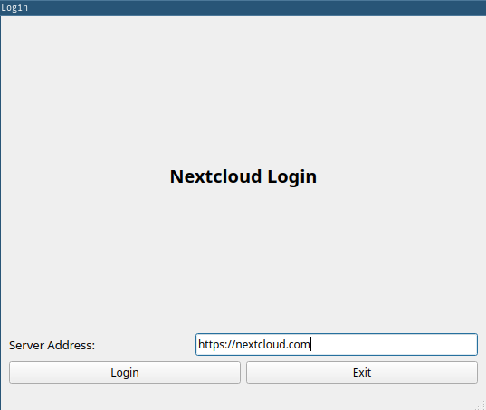
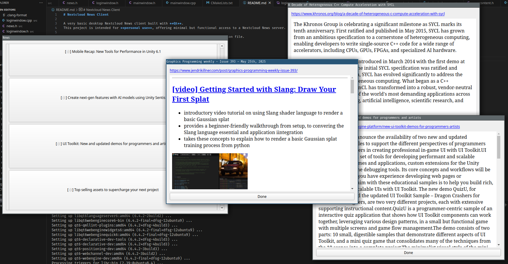

# Nextcloud News Client

A very basic desktop Nextcloud News client built with **Qt**.  
This project is intended for **personal use**, offering minimal but functional access to a Nextcloud News server.

Currently, the **Nextcloud app password is stored in plain text** in the configuration file.
⚠️ Encryption is planned but not yet implemented.




# Install
```
mkdir build && cd build
cmake ..
sudo cmake --build . -j --target install
```
